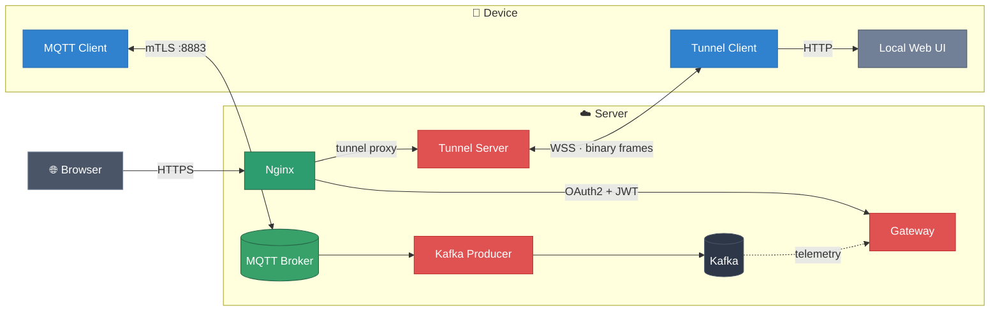

<h1 align="center">Nexus 🦀</h1>

### Secure remote access to IoT devices

Nexus is an IoT stack built around a simple idea: devices should be manageable from anywhere without exposing them
directly to the public Internet. The repository combines identity, messaging, telemetry ingestion, and a reverse tunnel
so a browser can safely reach a device-local web interface through an outbound device connection.

It is designed for environments where devices sit behind NAT, mobile networks, or firewalls. Instead of opening inbound
ports on the device, Nexus keeps control on the server side and lets the device initiate the connections it needs.

## What This Repository Contains

| Component        | Purpose                                                                            | Path                                             |
|------------------|------------------------------------------------------------------------------------|--------------------------------------------------|
| `gateway`        | User authentication, JWT issuance, device ownership, and API entrypoint            | [`gateway/`](gateway/)                           |
| `tunnel-server`  | Public-facing tunnel endpoint for browser access to device-local web services      | [`tunnel-server/`](tunnel-server/)               |
| `tunnel-client`  | Device-side outbound tunnel agent that proxies HTTP to the local device web server | [`tunnel-client/`](tunnel-client/)               |
| `mqtt-client`    | Device-side MQTT client for telemetry publishing and command handling              | [`mqtt-client/`](mqtt-client/)                   |
| `kafka-producer` | Bridge from MQTT topics into Kafka                                                 | [`kafka-producer/`](kafka-producer/)             |
| Kafka            | Device telemetry/event transport between ingestion and API persistence             | [`infrastructure/kafka/`](infrastructure/kafka/) |
| EMQX             | MQTT broker used for device communication                                          | [`infrastructure/emqx/`](infrastructure/emqx/)   |

## Core Use Cases

- Authenticate users with Google OAuth.
- Bind physical devices to user accounts.
- Collect device telemetry and keep the latest device state in the backend.
- Send commands to devices over MQTT and receive acknowledgements.
- Open a browser session to a device-local web server for management, diagnostics, or support.

## Architecture Overview

### User and API flow

Users authenticate through the `gateway` service using Google OAuth 2.0. After a successful login, `gateway` issues an
`RS256` JWT and exposes API endpoints for listing devices and binding a device to a user account. Ownership data is
stored in PostgreSQL, while Redis is used for short-lived OAuth state and JWT revocation state.

### Telemetry flow

On the device, `mqtt-client` connects to EMQX over mutual TLS and publishes device information. `kafka-producer`
subscribes to MQTT topics and forwards device messages into Kafka. The `gateway` service consumes Kafka messages and
updates the latest device state in PostgreSQL, giving the API a current view of devices and their metadata.

### Remote web access flow

For browser-based remote management, `tunnel-client` runs on the device and keeps WebSocket connection to
`tunnel-server`. A user with a valid JWT can request a short-lived tunnel session URL. Once the browser opens that URL,
`tunnel-server` forwards HTTP traffic through the live device tunnel to the local web service running on the device.
